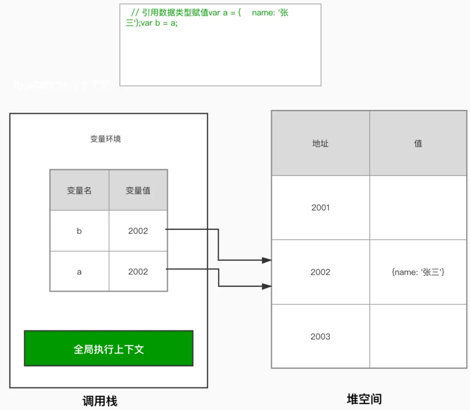

## let var const

#### 1
```js
var innerHeight = 100;
console.log(window.innerHeight); // 打印结果：永远都是100  ==> 会覆盖 window 自带的 innerHeight 属性
```

#### 2
```js
console.log(a); 
var a = '我是a';   
console.log(a);
```

```js
console.log(b); 
let b = '我是b';
// 报错：Uncaught ReferenceError: Cannot access 'b' before initialization ==> 找不到b这个变量
```

```js
console.log(c); 
const c = '我是c';
// 报错：Uncaught ReferenceError: Cannot access 'c' before initialization ==> 找不到c这个变量
```

#### 3
```js
{
    var a = '我是a';
    let b = '我是b';
    const c = '我是c';
}

console.log(a); 
console.log(b); 
console.log(c); 
```

#### 5 const 常量到底能不能被修改
举例 1：（不能修改）

```js
const name = 'hello';
name = 'world'; // 因为无法被修改，所以报错：Uncaught TypeError: Assignment to constant variable
```

举例 2：（不能修改）

```js
const obj = {
    name: 'hello',
    age: 12,
};

obj = { name: 'world' }; // 因为无法被修改，所以报错：Uncaught TypeError: Assignment to constant variable
```

举例 3：（可以修改）

```js
const obj = {
    name: 'hello',
    age: 28,
};
obj.name = 'world'; // 对象里的 name 属性可以被修改
```

## 作用域
```javascript

var a = 'aaa';
function foo() {
    var b = 'bbb';
    console.log(a); 
}

foo();
console.log(b);
// 打印结果：aaa。说明 内层作用域 可以访问 外层作用域 里的变量
// 报错：Uncaught ReferenceError: b is not defined。说明 外层作用域 无法访问 内层作用域 里的变量

```

#### 作用域链
```javascript
var a = 1

function fn1() {
  var b = 2

  function fn2() {
    var c = 3
    console.log(c)
    console.log(b)
    console.log(a)
  }
  fn2()
}
fn1()
```

## 闭包
```javascript
function f1(){
    let n=1;
    function f2(){
  　  console.log(++n); 
　　　}
　　　return f2;
}
let result=f1();
result();         // 2
result();         // 3
// 函数f2定义在函数f1内部，根据作用域链，f2可以读取f1中的所有局部变量，那么只要把f2作为返回值，我们就可以在f1外部读取f1的内部变量
```

## 数据类型
```javascript
    var obj1 = new Object();
    obj1.name = 'hello';

    var obj2 = obj1;

    obj1.name = 'world';

    console.log(obj1.name); 
    console.log(obj2.name);
```


#### 模版字符串
```javascript

var name = 'hello';
var age = '12';

console.log('我是' + name + ',age:' + age); 
console.log(`我是${name},age:${age}`)
```

####运算符
```javascript
let a = 10;
a = !a

console.log(a);  // false
console.log(typeof a); // boolean
```

## this
**针对第 1 条的举例**

```javascript
function fun() {
    console.log(this);
    console.log(this.name);
}

var obj1 = {
    name: 'hello',
    sayName: fun,
};

var obj2 = {
    name: 'world',
    sayName: fun,
};

var name = '全局的name属性';

fun(); //以函数形式调用，this是window，可以理解成 window.fun()
```

**第 2 条的举例**

```javascript
function fun() {
    console.log(this);
    console.log(this.name);
}

var obj1 = {
    name: 'hello',
    sayName: fun,
};

var obj2 = {
    name: 'world',
    sayName: fun,
};

var name = '全局的name属性';
obj2.sayName();
//以方法的形式调用，this是调用方法的对象
```

```javascript
function Fun() {
    console.log(this);
    console.log(this.name);
}

var name = '全局的name属性';
var f = new Fun();

//以构造函数的形式调用
```


### call()、apply()、bind()
```javascript
function foo() {
    console.log(this.a);
}

var obj = {
    a: 2
};
 
foo.apply(obj); 
foo.bind(obj)();
// 将 this 指向 obj
//打印结果：2
```

### call()和apply()的区别
```javascript
    var person1 = {
        name: "小王",
        gender: "男",
        age: 24,
        say: function (school, grade) {
            alert(this.name + " , " + this.gender + " ,今年" + this.age + " ,在" + school + "上" + grade);
        }
    }
    var person2 = {
        name: "小红",
        gender: "女",
        age: 18
    }
```
如果是通过call的参数进行传参，是这样的：
```javascript
	person1.say.call(person2, "实验小学", "六年级");
```

如果是通过apply的参数进行传参，是这样的：

```javascript
	person1.say.apply(person2, ["实验小学", "六年级"]);
```

## 解构赋值

```javascript
var arr = [1, 2, 3];
var a = arr[0];
var b = arr[1];
var c = arr[2];
console.log(a, b, c);
```

```javascript
var arr = [1, 2, 3];
var [a, b, c] = arr;
console.log(a, b, c);
```

```javascript
var person = {name: 'hello', age: 12 }
var { name, age, work } = person;
console.log(name, age, work)
```

### 设置默认值
```javascript
function fn(param) {
    let p = param || 'hello';
    console.log(p);
}

//ES6
function fn(param = 'hello') {
    console.log(param);
}
```

剩余参数
```javascript
const fn = (...args) => {
    //当不确定方法的参数时，可以使用剩余参数
    console.log(args[0]);
    console.log(args[1]);
    console.log(args[2]);
    console.log(args[3]);
};

fn(1, 2);
fn(1, 2, 3); //方法的定义中了四个参数，但调用函数时只使用了三个参数，ES6 中并不会报错。
```

扩展运算符
```javascript
const arr = [10, 20, 30];
console.log(...arr);
```


```javascript
let arr1 = ['http', 'www', 'com'];
let arr2 = arr1; 
arr2.push('hello'); //往 arr2 里添加一部分内容
console.log('arr1:' + arr1);
console.log('arr2:' + arr2);

//新数组
let arr2 = [...arr1]
```
